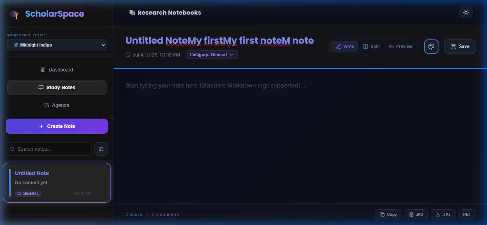

# Notes App - React Project



A beautiful, feature-rich note-taking application built with React. Create, edit, delete, and organize your notes with color tags. All notes are automatically saved to your browser's localStorage.

## Features

✨ **Core Features:**
- ✅ Create new notes with a single click
- ✅ Edit note title and content
- ✅ Delete notes with confirmation
- ✅ 7 color tags to organize notes (Red, Orange, Yellow, Green, Blue, Purple, Pink)
- ✅ Search notes by title or content
- ✅ Filter notes by color tag
- ✅ Automatic localStorage persistence
- ✅ Beautiful, modern UI with animations
- ✅ Responsive design (desktop and mobile)
- ✅ Word and character count
- ✅ Timestamp tracking for notes
- ✅ Auto-save functionality

## Project Structure

```
notes-app-project/
├── public/
│   └── index.html                 # Main HTML file
├── src/
│   ├── components/
│   │   ├── NoteEditor.js          # Note editor component
│   │   ├── NoteEditor.css         # Editor styling
│   │   ├── NotesList.js           # Notes list component
│   │   └── NotesList.css          # List styling
│   ├── App.js                     # Main app component
│   ├── App.css                    # App styling
│   ├── index.js                   # React entry point
│   └── index.css                  # Global styling
├── package.json                   # Dependencies and scripts
└── README.md                       # This file
```

## Installation

1. **Extract the zip file:**
   ```bash
   unzip notes-app-project.zip
   cd notes-app-project
   ```

2. **Install dependencies:**
   ```bash
   npm install
   ```

3. **Start the development server:**
   ```bash
   npm start
   ```

4. **Open your browser:**
   The app will automatically open at `http://localhost:3000`

## Usage

### Creating a Note
- Click the **"+"** button in the top-right corner of the sidebar
- Or use the **"Create Note"** button in the empty state

### Editing a Note
- Select a note from the sidebar
- Edit the title in the title field
- Edit the content in the text area
- Changes are automatically saved on blur

### Adding Color Tags
- Click the **Palette icon** in the note editor header
- Select a color from the color picker
- The color is automatically updated and saved

### Searching Notes
- Use the **Search box** in the sidebar
- Results are filtered in real-time by title and content

### Filtering by Color
- Click the color buttons in the **"Filter by color"** section
- Select **"All"** to see all notes
- Select a specific color to see only notes with that tag

### Deleting Notes
- Hover over a note in the sidebar
- Click the **Trash icon** that appears
- Confirm the deletion

## Technologies Used

- **React 18** - UI framework
- **Lucide React** - Beautiful icons
- **CSS3** - Modern styling with variables and animations
- **localStorage** - Data persistence
- **Google Fonts** - Typography (Poppins & Inter)

## Browser Support

- Chrome (latest)
- Firefox (latest)
- Safari (latest)
- Edge (latest)

## Available Scripts

### `npm start`
Runs the app in development mode. Open [http://localhost:3000](http://localhost:3000) to view it in your browser.

### `npm build`
Builds the app for production to the `build` folder.

### `npm test`
Launches the test runner in interactive watch mode.

## localStorage Details

All notes are stored in the browser's localStorage under the key `"notes"`. Each note object contains:
- `id` - Unique identifier (timestamp-based)
- `title` - Note title
- `content` - Note content
- `color` - Color tag (red, orange, yellow, green, blue, purple, pink)
- `createdAt` - ISO timestamp when note was created
- `updatedAt` - ISO timestamp when note was last updated

## Design Features

🎨 **Visual Design:**
- Dark theme with gradient backgrounds
- Smooth animations and transitions
- Modern glassmorphism effects
- Responsive grid layouts
- Accessible color contrast

⚡ **Performance:**
- Optimized re-renders
- Efficient state management
- Smooth animations
- Fast search and filter

## Tips & Tricks

1. **Auto-save**: Notes automatically save when you click away from the input
2. **Quick filter**: Use colors to quickly organize and filter your thoughts
3. **Timestamps**: Each note shows when it was last updated
4. **Persistent data**: Your notes survive browser refreshes (stored in localStorage)

## Troubleshooting

**Notes not saving?**
- Check that localStorage is enabled in your browser
- Clear browser cache and try again

**Styles not loading?**
- Make sure you're in the project directory
- Delete `node_modules` and `package-lock.json`, then run `npm install` again

**Port 3000 already in use?**
- Run `npm start` and the CLI will ask if you want to use a different port

## Future Enhancements

- Export notes to PDF or markdown
- Cloud sync with database
- Rich text editing (bold, italic, etc.)
- Note categories and nested organization
- Sharing and collaboration
- Dark/Light theme toggle
- Mobile app version
- Note encryption

## License

This project is created for educational purposes.

## Support

For issues or questions, please check the React and npm documentation or consult with your instructor.

---

**Happy Note-Taking! 📝**
